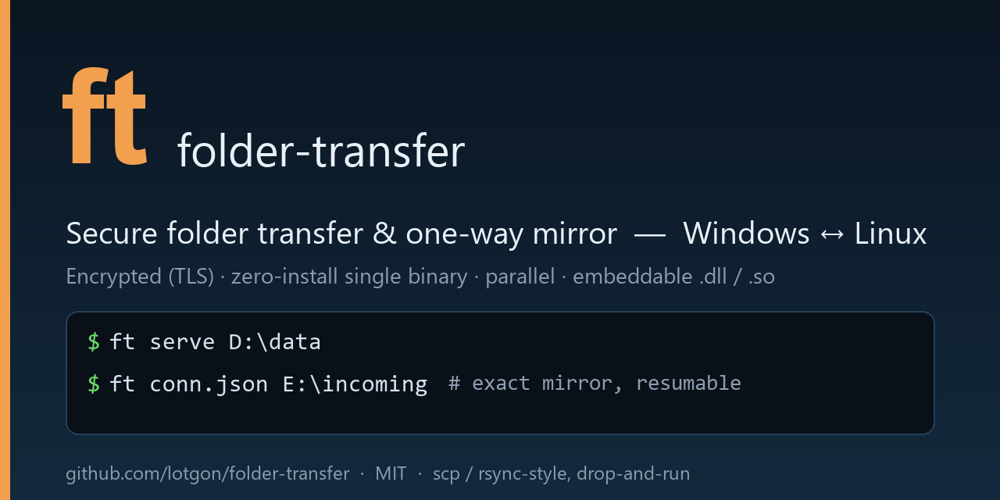

# ft — secure folder transfer & mirror-sync (Windows ↔ Linux)


<p align="center">
  
</p>

> **Move a folder from one server to another — encrypted, with one command. No install, no agent,
> no network shares.** `ft` is a drop‑and‑run, `scp`/`rsync`‑style tool: a single small static
> binary that serves *and* receives, keeps the far side an exact **one‑way mirror**, and runs on
> **Windows and Linux** (the two binaries talk to each other).

**The whole tool in one line:** run `ft <folder>` on the source, copy the command it prints, run it
on the destination.

```bat
:: SOURCE — share a folder; ft prints a ready-to-run command to copy:
ft D:\data
:: DESTINATION — paste that command; it then asks where to save:
ft get --server 10.0.0.1 --port 8722 --token <token> --fingerprint <fp>
```

**Why people use it**
- ⏱️ **Set up in ~1 minute** — drop one binary on each side and run; no SSH, no keys, no service to configure. [How it compares ↓](#how-it-compares)
- 🔒 **Encrypted & safe by default** — TLS with a pinned certificate + a one‑time token; nothing is left behind. [Why it’s safe ↓](#why-its-safe)
- 📦 **Zero install** — one ~3 MB static binary. No service, no dependencies, no admin (unless you let it open the firewall).
- 🪞 **Exact mirror, resumable** — only changed files move; re‑run to catch up; a dropped transfer resumes.
- 🗂️ **Reusable profiles** — save a fixed set of folders (+ ignore rules) once as a config and just run it; at the receiver you only pick *where*. [Details ↓](#many-folders--ignoring--config-file)
- 🚀 **Fast on bad links** — parallel streams for high‑latency WANs; thousands of small files bundled into a few round‑trips.
- 🧠 **Adaptive compression** — it figures out *by itself* when compressing is faster and when it isn’t (decided per block); never wastes CPU on fast links or already‑compressed data.
- 🧩 **Embeddable** — call it straight from .NET / C / C++ via `ft.dll` / `libft.so`.

A modern alternative to `scp`/`rsync` when you just need to **push a folder server‑to‑server**,
encrypted, with nothing to install — across Windows and Linux alike.

> Status: young but functional. Verified end‑to‑end Rust↔Rust on Windows and, via Docker, across
> the Windows ↔ Ubuntu boundary (byte‑for‑byte, mtime preserved). Review and test in your own
> environment before trusting production data — see [Limitations](#limitations).

---

## What it does

- **Mirror sync, not just copy.** Changed/new files are sent (compared by size + last‑write‑time),
  files removed on the source are deleted on the receiver, unchanged files are skipped. Re‑run any
  time to catch up; interrupted runs resume.
- **Fast where it’s usually slow.** Many small files are **bundled** (one round‑trip for thousands),
  big files are streamed, several **parallel streams** fill high‑latency links, and data is
  **compressed only when that’s actually faster** (adaptive — it measures the link and stays raw on
  fast links or already‑compressed data).
- **Secure by default.** TLS 1.2/1.3, the server’s certificate is **pinned** by the client
  (anti‑MITM), a one‑time **token** gates access, optional single‑IP allow‑list. Nothing is left
  behind: in‑memory cert, temporary firewall rule removed on exit.
- **Cross‑platform.** Native static binaries for Windows and Linux that interoperate; mtimes survive
  the NTFS ↔ ext4 round‑trip.
- **Live‑database cutover.** A two‑phase mode: pass 1 while the DB is up, you stop it, pass 2 copies
  only the delta — for a consistent copy with minimal downtime. See **[CUTOVER.md](CUTOVER.md)**.
- **Embeddable.** Drive it from .NET / C / C++ via a small C‑ABI library — no spawning a process.

## Problems it solves

- “I need to move a big folder (or a whole data directory) to another server **right now**, encrypted,
  without installing an agent, opening a share, or setting up rsync/SSH keys.”
- “I want a **repeatable mirror** — run it again and only the changes go.”
- “The link is fast but far (**high ping**), and a single copy crawls.” → parallel streams.
- “Thousands of tiny files take forever.” → bundling.
- “I need a **consistent copy of a live database**.” → [cutover mode](CUTOVER.md).
- “I want to trigger transfers **from my own application code**.” → the library/DLL.

## Who should use it — and who shouldn’t

**Good fit**
- One‑off or scripted **server‑to‑server** moves where you control both ends.
- Migrations (old box → new box), seeding a replica, shipping build artifacts or DB snapshots.
- Environments where you can’t/won’t install software — you just drop one binary.
- Apps that need to transfer folders in‑process (via `ft.dll` / `libft.so`).

**Look elsewhere if**
- You need **continuous, real‑time** sync or conflict resolution → use Syncthing / rsync+inotify / DFSR.
- You need **two‑way** sync — `ft` is strictly one‑way (source → destination mirror).
- You need **byte‑level delta within huge files** or **hash‑verified** integrity → use rsync/restic.
  `ft` compares by size+mtime and re‑sends a changed file whole.
- You’re exposing this on the **public internet** to untrusted clients — it’s built for trusted
  machine‑to‑machine use, not a hardened public service.

## How it compares

`ft` is closest to **scp/rsync**, but with nothing to install on either side and first‑class
Windows ↔ Linux support. It’s *not* a continuous two‑way syncer like Syncthing.

| | **ft** | scp | rsync | Syncthing |
|---|---|---|---|---|
| Install | **one binary, both sides** | SSH client/server | rsync (+SSH) | background service |
| Time to first copy, from zero¹ | **~1 min** | ~5–15 min | ~10–20 min | ~10–20 min |
| Setup effort / cost | **none — drop & run** | SSH server + keys/auth | SSH + rsync (Windows: WSL/cygwin) | install + pair devices |
| Reusable multi‑folder config | **yes — keep N JSON profiles, run one** | DIY script | DIY script / `--files-from` | yes (persistent) |
| Encryption | **TLS, built‑in** | via SSH | via SSH | TLS |
| Windows ↔ Linux | **yes, same tool** | ok | awkward on Windows | yes |
| Direction | one‑way push/pull | one‑way | one‑way | two‑way, continuous |
| Mirror (delete removed) | **yes** | no | yes (`--delete`) | yes |
| Resume after a drop | **yes** | no | yes | yes |
| Many small files | **bundled** | slow | good | good |
| High‑latency WAN | **parallel streams** | single stream | single stream | n/a |
| Adaptive compression | **yes — automatic on/off** | no | `-z` (manual) | yes |
| Live‑DB cutover ([details](CUTOVER.md)) | **yes** | no | no | no |
| Byte‑level delta in one file | no | no | **yes** | yes |
| Hash‑verified integrity | no (size+mtime) | n/a | optional | yes |
| Embeddable library | **yes (`.dll`/`.so`)** | no | no | no |

<sub>¹ Cold start with *nothing* pre‑configured. If SSH or the Syncthing service is already set up,
those tools start a copy quickly too — the point is that `ft` needs nothing set up at all: copy one
file to each side and run.</sub>

Rule of thumb: reach for **ft** for a quick, encrypted, drop‑and‑run **one‑way** copy/mirror between
machines you control — especially when you re‑copy the **same set of folders** repeatedly (save it
once as a config “profile” and just run it). Reach for **rsync** when you need byte‑level deltas or
checksums, and **Syncthing** when you need always‑on two‑way sync.

---

## Quick start

1. **Download** the binary for your OS from [Releases](https://github.com/lotgon/folder-transfer/releases):
   `ft-<ver>-x86_64-windows.zip` or `ft-<ver>-x86_64-linux.tar.gz`. Unzip; you get `ft` (or `ft.exe`).

2. **On the machine that has the data**, point `ft` at a folder (no subcommand — the folder *is* the
   argument):
   ```bat
   ft D:\data
   ```
   It prints a **highlighted, copy‑ready command** with the host, token and fingerprint baked in —
   that command *is* what you carry to the other machine (treat the token as a secret).

3. **On the machine that wants the data**, paste that command. It then asks where to save
   (Enter = the current folder):
   ```bat
   ft get --server 10.0.0.1 --port 8722 --token <token> --fingerprint <fp>
   ```
   The shared folder is recreated by name under the folder you choose (e.g. `data\…`). If the link
   drops, run it again — it resumes.

On the **source** you don’t even need a subcommand — `ft D:\data` or `ft sync.json` shares it (the
first argument decides: a folder or a config). The **receiver** just runs the printed `ft get …`
command. Flags (`--port`, `--once`, `--streams`, …) override anything.

## Many folders & ignoring — config file

Drop a JSON config (same keys as the legacy PowerShell tool). A ready, fully‑commented
**`server.example.json`** ships in the archive — it runs out of the box:

```bat
ft server.example.json
```
```jsonc
{
  "folders": [                                      // each arrives under its own name on the receiver
    "C:/Users/me/Documents",
    "C:/Users/me/Downloads",
    "C:/Users/me/Pictures"
  ],
  "ignore":  ["*.tmp", "~$*", "**/cache/"],         // .gitignore-style, case-insensitive
  "streams": 4,                                     // parallel connections (1 = classic)
  "compress": true,                                 // adaptive; false to disable
  "once": true,                                     // exit after one transfer
  "port": 8722
}
```
Paths: **forward slashes** `C:/path` or **doubled backslashes** `C:\\path`. `//` and `/* */`
comments allowed. CLI flags override the config.

**Reusable profiles.** Define the **set of folders** once and re‑use it. Keep one config per
recurring job — `nightly.json`, `migrate-to-new-pc.json`, `db-cutover.json` — each with its own
fixed `folders` + ignore rules. You never re‑type the folders; you just run the profile, and on the
receiver you only choose **where** it lands:

```bat
ft nightly.json                                                          ::  source: share the predefined folder set
ft get --server 10.0.0.1 --port 8722 --token <token> --fingerprint <fp>  ::  destination: it then asks where to put it
```

**Ignore rules:** `log` = a file/folder named `log` at any depth · `log/` = a *folder* only ·
`*.tmp` = wildcard within a name · `Bars/Reports/` = a path anchored at the shared‑folder name ·
`*/cache/` = one level deep · `**/cache/` = a `cache` folder at **any** depth. Ignored content is
never transferred and **never deleted** on the receiver; an ignored folder is recreated empty.

## Progress

During a transfer both sides print one aggregated line (~every 1.5 s) with the running totals and
**elapsed time**, so a long/slow transfer never looks frozen:

```
[ft serve] 8120 files, 1604.0 MB in 02:11 @ 215.0 MB/s
[ft]       8120 files, 1604.0 MB in 02:11 @ 215.0 MB/s
...
[ft] sync DONE. fetched=312 unchanged=7808 deleted=0 bytes=… in 02:13 @ 215.0 MB/s
```
If the connection drops it says so (`sync INCOMPLETE … re‑run to resume`) and exits non‑zero — no
silent hang.

---

## Performance

**Efficiency = goodput / channel capacity** — how much of the link the transfer actually uses.
Above 100% means adaptive compression delivered *more* original data than the wire physically
carried. Defaults (4 parallel streams + adaptive), over an emulated WAN at 0 ms and 150 ms RTT:

| data type | 20 Mbit | 20 Mbit +150ms | 100 Mbit | 100 Mbit +150ms | 200 Mbit | 200 Mbit +150ms |
|---|---|---|---|---|---|---|
| small files (10000 × 4 KB) — *disk‑bound* | 96% | 92% | 55% | 56% | 37% | 31% |
| large, incompressible (4 MB, random) | 96% | 92% | **99%** | **94%** | **99%** | **92%** |
| large, compressible (4 MB, text 3.73×) | 232% | 212% | 294% | 236% | 296% | 193% |

- **Small files** are limited by **file creation on the receiver’s disk** (filesystem metadata +
  antivirus), *not* the link. That’s why the % falls on faster links — e.g. **37% at 200 Mbit** isn’t
  `ft` being slow, it’s the disk: the link simply isn’t the bottleneck. (On Linux/ext4 with no
  real‑time AV, the same files fly — see [BENCHMARKS-rust.md](BENCHMARKS-rust.md).)
- **Incompressible** large files saturate fast links (94–99%).
- **Compressible** data goes far above 100% — fewer bytes on the wire, more original data per second.
- **Adaptive compression** decides all of this for you — automatically (see below).

**Adaptive compression — automatic, no flags.** `ft` measures, per block and per connection,
whether compressing actually moves data *faster*, and compresses only when it does. On a fast link,
or with already‑compressed data (`.zip`, `.jpg`, `.mp4`, …), it sends **raw** and wastes no CPU; on a
slow link with compressible data it **packs** and beats the wire (the 200–290% rows above). You never
pass `-z` or guess — the system figures out when to compress and when not to, on its own. (Force it
off with `--no-compress` if you ever need to.)

**Raw LAN throughput** (loopback, no link cap — the implementation’s own ceiling):

| data type | Windows | Ubuntu |
|---|---|---|
| small files (10000 × 4 KB) | 8.4 MB/s | ~100 MB/s |
| large, incompressible | ~118 MB/s | ~288 MB/s |
| large, compressible | (adaptive) | ~1.1 GB/s |

On Windows that’s ~1.5× the PowerShell edition on incompressible data; small files are NTFS+Defender
bound (on Linux, with no real‑time AV, they fly). Full method, machine specs and cross‑OS results:
**[BENCHMARKS-rust.md](BENCHMARKS-rust.md)** (scripts in [`bench/`](bench)).

---

## Cross‑platform

The Windows and Linux binaries speak the same protocol and interoperate — serve on Ubuntu, receive
on Windows, or vice versa. The Linux CLI is a **fully static musl** binary (no dependencies). mtimes
survive the NTFS ↔ ext4 round‑trip, so a re‑sync is a clean no‑op.

## Embed it in your code (library)

Each release also ships a C‑ABI shared library — **`ft.dll`** (Windows) and **`libft.so`** (Linux) —
so you can transfer folders straight from .NET, C, or C++ without spawning the CLI. A C header
([`ffi/ft.h`](rust/ffi/ft.h)) and a ready .NET binding ([`ffi/FolderTransfer.cs`](rust/ffi/FolderTransfer.cs))
are included.

```csharp
// receiver side — pull a folder into E:\incoming
FolderTransfer.Get("10.0.0.1", 8722, token, fingerprint, @"E:\incoming");

// source side — serve in the background; token + fingerprint come back to hand to the receiver
var srv = new FolderTransfer.Server(@"D:\data", 8722);
Console.WriteLine($"{srv.Token} {srv.Fingerprint}");
srv.Wait();
```

C ABI: `ft_get`, `ft_serve_start` / `ft_serve_wait`, `ft_last_error` (UTF‑8 strings, `0` = success).

## Why it's safe

Everything goes over **TLS**, the client only trusts **your** server (pinned certificate), and only
a holder of the **one‑time token** can pull. The server is read‑only and leaves no trace.

| Layer | What it does |
|------|--------------|
| TLS 1.2/1.3 (rustls) | Encrypts the whole session — vetted crypto, not hand‑rolled. |
| Certificate pinning | Client refuses any server whose cert fingerprint doesn’t match (anti‑MITM). The fingerprint is public; share it freely. |
| Token (auto) | Random one‑time secret the client must present, sent inside TLS — this is the access key; keep it private. |
| IP allow‑list | `--allow-ip` serves only one client IP. |
| Read‑only, path‑safe | The client receives files **by name validated under the destination**; the server never executes anything. |
| No trace | In‑memory self‑signed cert; the Windows firewall rule (best‑effort, needs admin) is removed on exit. |

## Install

Download a release archive, unzip, and run `ft` / `ft.exe`. No installer, no runtime. Optional: put
it on your `PATH`. On Linux: `tar xzf ft-<ver>-x86_64-linux.tar.gz && ./ft-<ver>/ft /srv/data`.

## Limitations

- Young tool — verified Rust↔Rust on Windows and Win↔Ubuntu via Docker; test before production use.
- One‑way mirror only (source → destination); no two‑way sync, no conflict handling.
- Change detection is **size + mtime, not a hash**; a same‑size corruption isn’t detected.
- A changed file is re‑fetched whole — no byte‑level resume within a single huge file.
- A fresh cert each server run → the fingerprint changes, so an old connection file won’t connect to
  a new server instance (by design).
- Parallel mode deletes files, not directories, so a folder emptied on the source may remain as an
  empty folder on the receiver.
- The connection file / printed command holds the token — treat it as a secret.

## PowerShell edition

A pure‑PowerShell, Windows‑only edition (no binary at all) also lives here for people who want a
script‑only tool: **[POWERSHELL.md](POWERSHELL.md)**.

## License

MIT — see [LICENSE](LICENSE). Copyright (c) 2026 Andrei Pazniak. Provided as‑is, without warranty;
review the code and test in your environment before using it on production systems.
